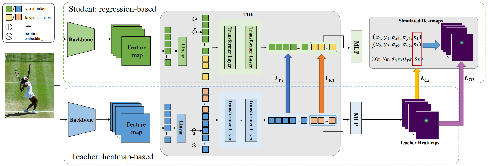

# DistilPose:  Tokenized Pose Regression with Heatmap Distillation
Implementation for: DistilPose:  Tokenized Pose Regression with Heatmap Distillation

> [**DistilPose:  Tokenized Pose Regression with Heatmap Distillation**](https://arxiv.org/pdf/2303.02455.pdf),            
> Suhang Ye\*, Yingyi Zhang\*, Jie Hu\*, Liujuan Cao, Shengchuan Zhang<sup>✉</sup>, Lei Shen, Jun Wang, Shouhong Ding, Rongrong Ji. \
> In: Conference on Computer Vision and Pattern Recognition~(CVPR), 2023   
> *arXiv preprint ([arXiv 2303.02455](https://arxiv.org/abs/2303.02455))*  
> (\* equal contribution)

# Introdoction
In the field of human pose estimation, regression-based methods have been dominated in terms of speed, while heatmap-based methods are far ahead in terms of performance. How to take advantage of both schemes remains a challenging problem. In this paper, we propose a novel human pose estimation framework termed ***DistilPose***, which *bridges the gaps between heatmap-based and regression-based methods*. 

   

Our contributions are summarized as follows:
- We propose a novel human pose estimation framework, ***DistilPose***, which is *the first work to transfer knowledge between heatmap-based and regression-based models losslessly*.
- We introduce a novel **Token-distilling Encoder (TDE)** to take advantage of both heatmap-based and regression-based models. With the proposed TDE, the gap between the output space of heatmaps and coordinate vectors can be facilitated in a tokenized manner.
- We propose **Simulated Heatmaps** to model explicit heatmap information, including 2D keypoint distributions and keypoint confidences. With the aid of Simulated Heatmaps, we can transform the regression-based HPE task into a more straightforward learning task that fully exploits local information. Simulated Heatmaps can be applied to any heatmap-based and regression-based models for transferring heatmap knowledge to regression models.

# Installation & Quick Start
DistilPose depends on PyTorch and MMPose, please install following packages:
```
conda create -n distilpose python=3.8 pytorch=1.7.0 torchvision -c pytorch -y
conda activate distilpose
pip3 install openmim
mim install mmcv-full==1.3.8
git submodule update --init
cd mmpose
git checkout v0.22.0
pip3 install -e .
cd ..
pip3 install -r requirements.txt
```
Download teacher checkpoint and save to "./teacher_chkpts". Train model on COCO as below:
```
./tools/dist_train.sh configs/body/2d_kpt_sview_rgb_img/distilpose/coco/DistilPose_S_coco_256x192.py 8
```
For evaluating on COCO, downlowd checkpoint and run the following command lines:
```
./tools/dist_test.sh configs/body/2d_kpt_sview_rgb_img/distilpose/coco/DistilPose_S_coco_256x192.py \
./checkpoints/distilpose_s.pth 8
```

# Models
## COCO Keypoint Detection Results
| Name | Role | Param | GFLOPs | AP | download |
| ---- | ---- | ----- | ------ | -- | -------- |
|[DistilPose-S](configs/body/2d_kpt_sview_rgb_img/distilpose/coco/DistilPose_S_coco_256x192.py)| Student | 5.4 | 2.38 | 71.6 | [Code:3733](https://pan.baidu.com/s/16k7nwQ9vaqJakxtpP0-o8g) |
|[DistilPose-L](configs/body/2d_kpt_sview_rgb_img/distilpose/coco/DistilPose_L_coco_256x192.py)| Student | 21.3 | 10.33 | 74.4 | [Code:5tni](https://pan.baidu.com/s/1I8MiunGjDNolnj-2246WIg) |
|[TokenPose-L](configs/body/2d_kpt_sview_rgb_img/tokenpose/coco/teacher_hr48_coco_256x192.py)| Teacher | 69.4 | 17.03 | 75.2 | [Code:b8vn](https://pan.baidu.com/s/1nZpNbLIwOM3vtuyokQuFNQ) |

# Citations
Please consider citing our papers in your publications if the project helps your research. BibTeX reference is as follows.
```BibTeX
@article{ye2023distilpose,
  title={DistilPose: Tokenized Pose Regression with Heatmap Distillation},
  author={Ye, Suhang and Zhang, Yingyi and Hu, Jie and Cao, Liujuan and Zhang, Shengchuan and Shen, Lei and Wang, Jun and Ding, Shouhong and Ji, Rongrong},
  journal={arXiv preprint arXiv:2303.02455},
  year={2023}
}
```